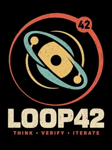

**English:** [README.md](README.md) · **Deutsch**

# Loop42

  

Loop42 ist ein wiederverwendbares Entwicklungs- und Factory-System für komplexe Projekte mit KI-gestützten Arbeitsabläufen, bei denen Ausführung begrenzt, evidenzbasiert und wiederherstellbar bleibt.

Die interne Methode heißt **Matrixloop**: ein kompakter Loop, der den Live-Zustand abgleicht, ein sinnvolles Ziel auswählt, implementiert oder prüft, das Ergebnis verifiziert, es mit realistischen Gegenbeispielen herausfordert und stoppt, sobald eine weitere Runde keinen messbaren Mehrwert mehr bringt.

## Was Loop42 macht

Loop42 stellt generische Entwicklungsmechanik bereit für:

- begrenzte Iteration und explizite Stopregeln
- Source-of-Truth- und Stale-State-Behandlung
- Recovery und Reconciliation
- Single-Writer- / Live-HEAD-Guards
- Harness-Capability-Contracts
- Prompt- und Skill-Evaluation
- Run-Budgets und Stop-Receipts
- Provenance- und Third-Party-License-Gates
- GitHub-Visibility- und Freshness-Prüfungen
- wiederverwendbare Context- und Navigationshelfer
- Frozen-Scenario-Evaluation
- Candidate Learning und kontrollierte Evolution

## Designprinzipien

**Evidence statt Selbstvertrauen.**  
Behauptungen sollen an reproduzierbare Evidence, exakte Revisionen oder klar markierte Unsicherheit gebunden sein.

**Eine Wahrheit, viele Worker.**  
Mehrere Modelle oder Werkzeuge dürfen ein Projekt prüfen und herausfordern, aber sie erzeugen keine konkurrierenden autoritativen Zustände.

**Begrenzte Autonomie.**  
Automatisierung darf innerhalb expliziter Autoritätsgrenzen nützliche Arbeit erledigen. Fehlende Fähigkeit oder Evidence bleibt sichtbar, statt erraten zu werden.

**Nützliches Delta statt Prozessvolumen.**  
Der Loop existiert, um das Projekt zu verbessern. Eine Prüfung oder Iteration ohne eigene Entscheidung, Evidence, Fehlerfund oder Implementierungswert soll zusammengelegt, vereinfacht oder gestoppt werden.

**Recovery by Design.**  
Arbeit soll aus explizitem aktuellem Zustand, akzeptierten Entscheidungen, verifizierten Ergebnissen und offenen Blockern fortsetzbar sein.

**Standardmäßig portabel.**  
Provider-spezifisches Verhalten gehört hinter dünne Adapter. Matrixloop-Regeln sollen nicht von einem einzelnen KI-Anbieter, einer IDE, Chat-Oberfläche oder einem lokalen Modell abhängen.

**Execution Fit vor Operator-Arbeit.**  
Prüfe Machbarkeit, Nutzen und Operator-Reibung, bevor Setup-Schritte abgegeben werden. Bevorzuge den einfachsten brauchbaren Weg, der Ziel sowie Safety-/Quality-Grenzen erfüllt.

## Matrixloop in einer Zeile

`RECONCILE → TARGET → PRE-MORTEM → IMPLEMENT/INSPECT → VERIFY → FRICTION → VALUE CHECK → STOP/ITERATE`

Die Sequenz ist kein Ritual. Schritte dürfen zusammenfallen, wenn die notwendige Evidence bereits vorhanden ist.

## Repository-Struktur

- `docs/MATRIXLOOP.md` — Matrixloop-Lifecycle und Stopregeln
- `docs/EXECUTION_FIT.md` / [Deutsch](docs/EXECUTION_FIT.de.md) — Capability-/Value-/Operator-Fit vor Setup oder Ausführung
- `docs/TRUTH_AND_GAPS.md` / [Deutsch](docs/TRUTH_AND_GAPS.de.md) — begrenzte Evidence- und Gap-Workflows
- `docs/EXTERNAL_PATTERN_SCOUT.md` / [Deutsch](docs/EXTERNAL_PATTERN_SCOUT.de.md) — begrenztes externes Pattern-Scouting
- `docs/HARNESS_CONTRACT.md` — wiederverwendbare Harness-Capability-Grenze
- `docs/CONSUMER_PROFILE.md` — Contract für Exact-Revision-Consumer-Binding
- `docs/RECOVERY_AND_TRUTH.md` — Truth-, Stale-State- und Recovery-Regeln
- `docs/EVALUATION.md` — Frozen-Scenario- und Methoden-Evaluation
- `docs/LICENSE_POLICY.md` — aktuelle Lizenzregel
- `docs/PUBLICATION_GATE.md` / [Deutsch](docs/PUBLICATION_GATE.de.md) — Safety- und Operator-Entscheidungs-Gate für die Veröffentlichung
- `docs/DOCUMENTATION_LANGUAGE_POLICY.md` / [Deutsch](docs/DOCUMENTATION_LANGUAGE_POLICY.de.md) — Zweisprachigkeitsregel
- `THIRD_PARTY.md` — externe Quellen und Provenance-Ledger
- `tools/` — wiederverwendbare Harness-, Context- und Verification-Utilities
- `tests/frozen_scenarios/` — reproduzierbare Evaluationsszenarien
- `adapters/` — Beispiele für Consumer-Integration

## Dokumentationssprachen

Menschenlesbare Kern-Dokumentation folgt grundsätzlich **Englisch + Deutsch**. Code, Schemas, APIs, Tests und andere maschinennahe Artefakte bleiben Englisch, damit Zweisprachigkeit keine doppelte technische Wahrheit oder Wartungshölle erzeugt.

Siehe [Dokumentations-Sprachregel](docs/DOCUMENTATION_LANGUAGE_POLICY.de.md).

## Consumer-Projekte

Loop42 ist projektagnostisch. Consumer-Projekte behalten ihren eigenen Produktzustand, ihre Domänenregeln und Autoritätsgrenzen und können eine exakte Loop42-Revision bzw. ein Profil pinnen.

CORA ist das erste Consumer-Projekt; seine Produktwahrheit bleibt außerhalb dieses Repositories.

## Status

Privates Entwicklungs-Repository.

Die **v0.1 Extraction-/Consumer-Binding-Foundation ist verifiziert**. Wiederverwendbare Context-/Harness-Mechanik, Frozen-CORA-Equivalence und der Exact-Revision-Consumer-Profile-Contract sind vorhanden. Milestone-Issue #4 ist geschlossen; Repository-Contracts und Tests bleiben autoritativ.

CORA pinnt derzeit die verifizierte Loop42-Revision `de5be0fa5e085d63c8f98fe683f9936828478dbf`. Dieser Pin ist absichtlich exakt und floatet nicht mit, nur weil Loop42 `main` weiterläuft.

Loop42 steht unter der MIT-Lizenz. Öffentliche Sichtbarkeit bleibt weiterhin durch das Publication Gate und eine ausdrückliche Operator-Entscheidung geschützt.

Warum 42?

Weil gute Systeme begrenzte Loops, ehrliche Evidence und wiederherstellbaren Zustand brauchen —  
und gelegentlich die richtige Frage vor der richtigen Antwort.

